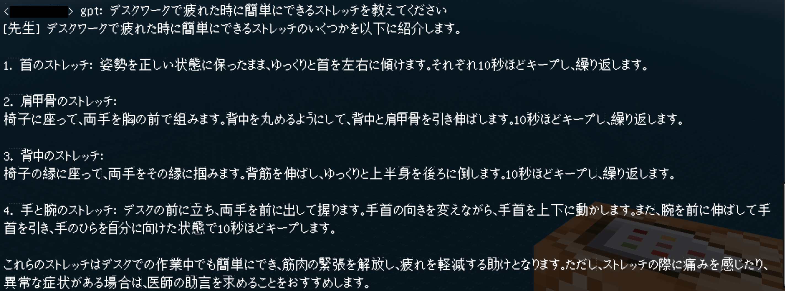

# Minecraft-GPT
Minecraft統合版及びEducation EditionにおいてMinecraft上のチャットからGPTを呼び出せるようにするためのWebSocketサーバです。

統合版における使い方は[こちら](https://github.com/akahoshi1421/Minecraft-GPT/blob/main/README.md)

## 一例


## 使い方
1. パッケージをインストールする
    ```shell
    npm i
    ```

2. .envファイルを作成する
    ```shell
    touch .env
    ```

3. .envファイルに以下のような記述する

    [openAIのサイト](https://platform.openai.com/account/api-keys)にアクセスし、Create new secret keyを押し、APIキーを発行します。
    **※ completionsのみ対応しています**
    ```.env
    URL="{{ API_URL }}"
    API_KEY="{{ YOUR_API_KEY }}"
    ```
    URLは特別な事情がなければ "https://api.openai.com/v1/chat/completions" になると思います。
    API_KEYは先ほど発行したAPIキーを入れてください。

4. サーバを走らせる
    ```shell
    node server.js
    ```

5. Minecraftのワールドに入り、設定を変更する

    設定 -> 一般 -> "暗号化された WebSocket の要求" の項目をオフにする

6. Minecraftのチャットから以下のコマンドを入力
    ```.mcfunction
    /wsserver localhost:9999
    ```
    正常に動いていたら"サーバーへの接続を確立しました: ws://localhost:9999"と表示されます。

7. Minecraftのチャットから以下の文章を入力
    ```
    gpt: 入力したい文章
    ```
    するとしばらくした後にGPTからの返答がチャット上に表示されます。

    **※ "gpt:"の後ろにスペースが入るのでご注意ください**